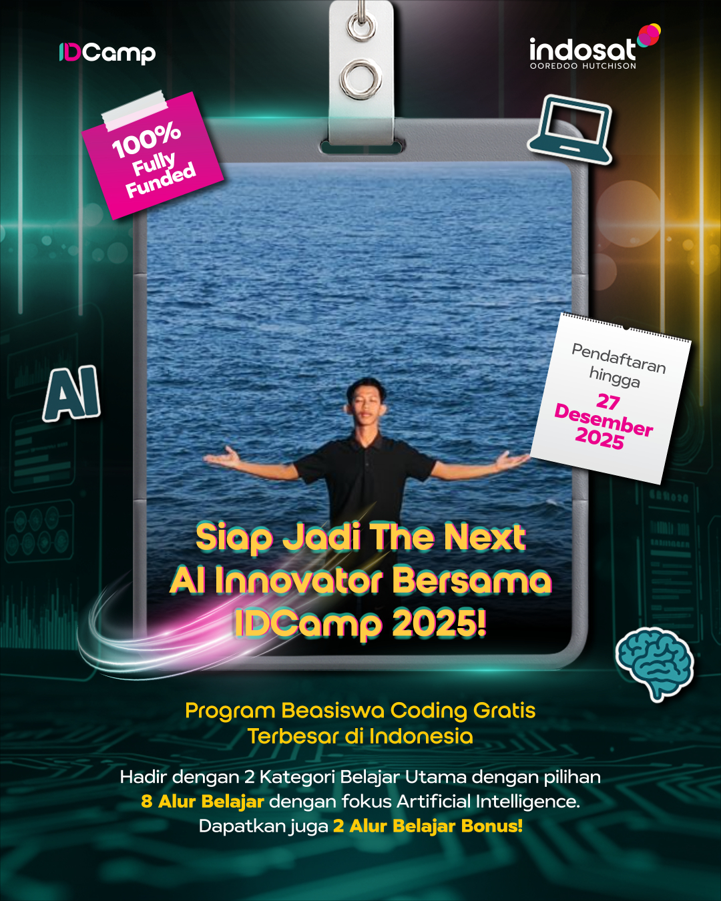

**🚀I'm Ready for The Next Al Innovator bersama program IDCamp 2025!🚀**
_Dengan kurikulum lengkap mulai dari:_
- 🤖 Al Engineer
- ⚡ Gen Al Engineer
- 🔧 MLOps Engineer
- 📊 Data Scientist
- 📱 Al Android Developer
- 📲 Al Multi-platform App Developer
- 🎨 Al Front-End Web Developer
- 🛠 Al Back-End Developer JavaScript

_Semua bisa kamu pelajari GRATIS lewat IDCamp 2025.
Yuk, siapkan dirimu jadi bagian dari generasi digital Indonesia!✨_

###### Daftarkan Dirimu Sekarang: [Beasiswa IDCamp 2025](https://idcamp.ioh.co.id/login?referrer_id=5054546)

#
#### 👦 About Me
Hello World!!👋
I am **Choirul Rizki**, a Bachelor of Economics graduate from UIN Kiai Ageng Muhammad Besari Ponorogo. I am passionate about Data Analytics and Data Scientist, with strong analytical and technical skills in data processing, visualization, and interpretation to support data-driven decision-making and business insights.

#
##### 🌐 Socials

  <a href="https://www.linkedin.com/in/choirulrizki/" target="_blank">
    
    
  <a href="https://
www.choirulrizki022@gmail.com/" target="_blank">
    
  <a href="https://wa.me//62895630426259 " target="_blank">
    

# 
##### 🤖 Data, Desaign & Machine Learning Tools

 

  
 
  

  

  

  

  

  

  

  

  

  

  

  

  
  
  
 
  

  

  

  

# 
_Another Tools: Ms. Office, Power BI, Tableau, Looker Studio_

#
##### 🪼 Play Game With Me

###

